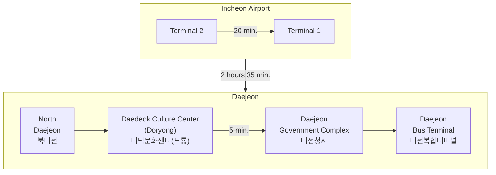

From the Incheon Airport, you can take the airport bus to the Daedeok Culture Center (or, also known as Doryong). The bus will take you directly. The bus ride will take roughly **2 hours 40 minutes**.

You can buy bus tickets inside the airport near Exit 4 and in between 8 and 9; and outside just left of Exit 11.
At the ticket office, you can purchase the ticket for **Daedeok Culture Center (대덕문화센터)** Bus Stop (or Doryong Bus Stop).

#### Bus Schedule (as of May 2024)

|	Departure	|	Class	|	Fare for an Adult	(KRW)|
|  :--:|	:--:	|	:--:	|
|	06:20		|	Deluxe (우등)	|25,500	|
|	06:40		|	Premium (프리미엄)	|33,100	|
|	06:50		|	Deluxe (우등)	|25,500	|
|	07:00		|	Deluxe (우등)	|25,500	|
|	07:20		|	Deluxe (우등)	|25,500	|
|	07:40		|	Deluxe (우등)	|25,500	|
|	08:00		|	Deluxe (우등)	|25,500	|
|	08:20	    |	Premium (프리미엄)	|33,100	|
|	08:40		|	Deluxe (우등)	|25,500	|
|	09:00	    |	Deluxe (우등)	|25,500	|
|	09:20		|	Premium (프리미엄)	|33,100	|
|	09:40		|	Deluxe (우등)	|25,500	|
|	09:50	    |	Deluxe (우등)	|25,500	|
|	10:00		|	Deluxe (우등)	|25,500	|
|	10:10		|	Premium (프리미엄)	|33,100	|
|	10:30		|	Deluxe (우등)	|25,500	|
|	10:40		|	Deluxe (우등)	|25,500	|
|	10:50		|	Premium (프리미엄)	|33,100	|
|	11:10		|	Deluxe (우등)	|25,500	|
|	11:20		|	Deluxe (우등)	|25,500	|
|	11:30		|	Deluxe (우등)	|25,500	|
|	11:50		|	Premium (프리미엄)	|33,100	|
|	12:10		|	Deluxe (우등)	|25,500	|
|	12:30		|	Premium (프리미엄)	|33,100	|
|	12:50		|	Deluxe (우등)	|25,500	|
|	13:10		|	Deluxe (우등)	|25,500	|
|	13:40		|	Premium (프리미엄)	|33,100	|
|	13:50		|	Deluxe (우등)	|25,500	|
|	14:00		|	Deluxe (우등)	|25,500	|
|	14:20		|	Deluxe (우등)	|25,500	|
|	14:40		|	Premium (프리미엄)	|33,100	|
|	15:00		|	Deluxe (우등)	|25,500	|
|	15:20		|	Deluxe (우등)	|25,500	|
|	15:40		|	Premium (프리미엄)	|33,100	|
|	16:00		|	Deluxe (우등)	|25,500	|
|	16:20		|	Premium (프리미엄)	|33,100	|
|	16:40		|	Deluxe (우등)	|25,500	|
|	17:00		|	Premium (프리미엄)	|33,100	|
|	17:10		|	Deluxe (우등)	|25,500	|
|	17:20		|	Deluxe (우등)	|25,500	|
|	17:40		|	Deluxe (우등)	|25,500	|
|	18:00		|	Premium (프리미엄)	|33,100	|
|	18:20		|	Deluxe (우등)	|25,500	|
|	18:40		|	Premium (프리미엄)	|33,100	|
|	18:50		|	Deluxe (우등)	|25,500	|
|	19:00		|	Deluxe (우등)	|25,500	|
|	19:20		|	Deluxe (우등)	|25,500	|
|	19:40		|	Deluxe (우등)	|25,500	|
|	20:00		|	Premium (프리미엄)	|33,100	|
|	20:20		|	Deluxe (우등)	|25,500	|
|	20:40		|	Premium (프리미엄)	|33,100	|
|	20:50		|	Deluxe (우등)	|25,500	|
|	21:10		|	Deluxe (우등)	|25,500	|
|	21:30		|	Deluxe (우등)	|25,500	|
|	21:50		|	Premium (프리미엄)	|33,100	|
|	22:20		|	Deluxe (우등)	|28,100 	|
|	22:50		|	Deluxe (우등)	|28,100 	|
|	23:20		|	Deluxe (우등)	|28,100 	|

{: .note}
The prices are almost same for all four stops in Daejeon (North Daejeon, Daedeok Culture Center
     (Doryong), Government Complex, and Daejeon Bus Terminal). Although the Daedeok Culture Center is also close to IBS, there are not many taxis waiting at the stop. 

The bus to Daejeon will be at **bus platform 11A-3**.
The ticket will have your departure time and your seat number.
There is no bathroom on the bus. Sometimes the bus stops at the highway rest area for 10 or 20 minutes.

|||
|:--:|:--:|
|*Inside Ticket Office (Gate 8/9)*|*Outside Ticket Office (Gate 11)*|
|||
|*Bus Platform 11A*|*Bus to Daejeon*|

- Price: KRW 25,500 for deluxe and KRW 33,100 for premium. Night buses (after 10pm) are 10% more expensive.
- Schedule: Earlist at 06:20. Last at 23:20.
- [Online booking](https://intercitybuse.tmoney.co.kr/) at [https://intercitybuse.tmoney.co.kr/](https://intercitybuse.tmoney.co.kr/) :  You can check the time schedule and the current availability of the seats. But it is not yet clear whether it accepts a credit card issued by foreign banks -- please let us know if it works.
  - Departure: IncheonAirportT1
  - Destination: Daedeokcommunitycenter

