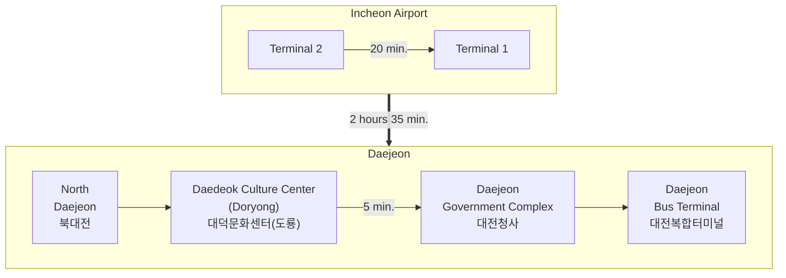



From the Incheon Airport, you can take the airport bus to the Daedeok Culture Center (or, also known as Doryong). The bus will take you directly. The bus ride will take roughly **2 hours 40 minutes**.

You can buy bus tickets inside the airport near Exit 4 and in between 8 and 9; and outside just left of Exit 11.
At the ticket office, you can purchase the ticket for **Daedeok Culture Center (대덕문화센터)** Bus Stop (or Doryong Bus Stop).
#### Bus Schedule (as of {{ s.updated }})

| Departure | Class | Fare for an Adult (KRW) |
| :--: | :--: | :--: |
| {{ row.time }} | {{ row.class }} | {{ row.fare }} |


{: .note}
The prices are almost same for all four stops in Daejeon (North Daejeon, Daedeok Culture Center
     (Doryong), Government Complex, and Daejeon Bus Terminal). Although the Daedeok Culture Center is also close to IBS, there are not many taxis waiting at the stop. 

```mermaid
flowchart TD;
subgraph ICN["Incheon Airport"]
direction LR
    icn2["Terminal 2"]  
    --20 min. -->icn1["Terminal 1"]
end
subgraph Daejeon
direction LR
    nd["North 
    Daejeon
    북대전"]
    --> doryong["Daedeok Culture Center
     (Doryong)
    대덕문화센터(도룡)"]
    --5 min.--> gov["Daejeon 
    Government Complex
    대전청사"]
    --> dt["Daejeon 
    Bus Terminal
    대전복합터미널"]
end

ICN == 2 hours 35 min.==>Daejeon
```

The bus to Daejeon will be at **bus platform 11A-3**.
The ticket will have your departure time and your seat number.
There is no bathroom on the bus. Sometimes the bus stops at the highway rest area for 10 or 20 minutes.

|||
|:--:|:--:|
|*Inside Ticket Office (Gate 8/9)*|*Outside Ticket Office (Gate 11)*|
|||
|*Bus Platform 11A-3*|*Bus to Daejeon*|

- Price: KRW 25,500 for deluxe and KRW 33,100 for premium. Night buses (after 10pm) are 10% more expensive.
- Schedule: Earliest at {{ s.first_bus }}. Last at {{ s.last_bus }}.
- [Online booking](https://intercitybuse.tmoney.co.kr/) at [https://intercitybuse.tmoney.co.kr/](https://intercitybuse.tmoney.co.kr/) :  You can check the time schedule and the current availability of the seats. 
  - Departure: IncheonAirportT1
  - Destination: Daedeokcommunitycenter
It was announced that foreign credit cards (VISA, Master, JCB, UnionPay) would work on this website from July 2024. Please let us know if it worked. If you want to use foreign credit cards, you may want to choose "GLOBAL CARD" in the list of credit cards. For "Card Password", it only needs the first 2 digits of your credit card password. For "Resident Registration Number (front 6 digits"), you simply need to type your birthday in YYMMDD format. For the Cellular Phone number, if you don't have the Korean mobile phone number, put any number. That is for the identification. For the Card Password, you only need to put the first 2 digits of your credit card PIN code.

