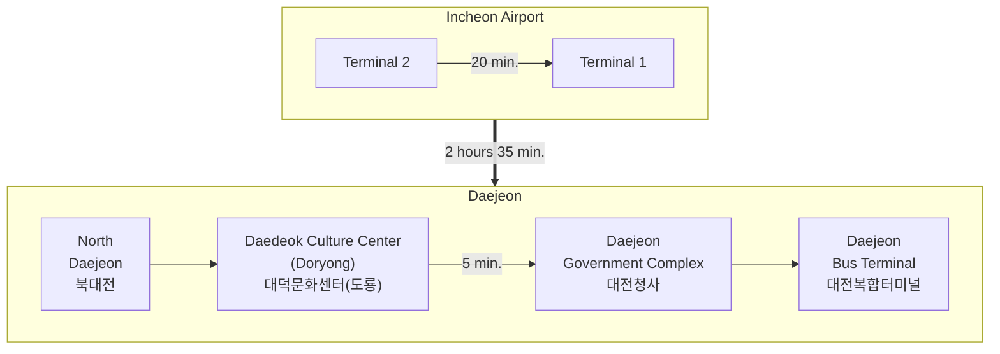

For most visitors, this is the most recommended method to visit IBS.
From the Incheon Airport, you can take the airport bus to the Daejeon Government Complex. The bus will take you directly. The bus ride will take roughly **2 hours 40 minutes**.

You can buy bus tickets inside the airport near Exit 4 and in between 8 and 9; and outside just left of Exit 11.
At the ticket office, you can purchase the ticket for **Daejeon Government Complex (대전청사)** Bus Stop. 

#### Bus Schedule (as of May 2024)

|	Departure	|	Arrival	|	Class	|	Fare for an Adult	(KRW)|
|  :--:	|	:--:	|	:--:	|	:--:	|
|	06:20	|	09:06	|	Deluxe (우등)	|26,100	|
|	06:40	|	09:26	|	Premium (프리미엄)	|34,000	|
|	06:50	|	09:36	|	Deluxe (우등)	|26,100	|
|	07:00	|	09:46	|	Deluxe (우등)	|26,100	|
|	07:20	|	10:06	|	Deluxe (우등)	|26,100	|
|	07:40	|	10:26	|	Deluxe (우등)	|26,100	|
|	08:00	|	10:46	|	Deluxe (우등)	|26,100	|
|	08:20	|	11:06	|	Premium (프리미엄)	|34,000	|
|	08:40	|	11:26	|	Deluxe (우등)	|26,100	|
|	09:00	|	11:46	|	Deluxe (우등)	|26,100	|
|	09:20	|	12:06	|	Premium (프리미엄)	|34,000	|
|	09:40	|	12:26	|	Deluxe (우등)	|26,100	|
|	09:50	|	12:36	|	Deluxe (우등)	|26,100	|
|	10:00	|	12:46	|	Deluxe (우등)	|26,100	|
|	10:10	|	12:56	|	Premium (프리미엄)	|34,000	|
|	10:30	|	13:16	|	Deluxe (우등)	|26,100	|
|	10:40	|	13:26	|	Deluxe (우등)	|26,100	|
|	10:50	|	13:36	|	Premium (프리미엄)	|34,000	|
|	11:10	|	13:56	|	Deluxe (우등)	|26,100	|
|	11:20	|	14:06	|	Deluxe (우등)	|26,100	|
|	11:30	|	14:16	|	Deluxe (우등)	|26,100	|
|	11:50	|	14:36	|	Premium (프리미엄)	|34,000	|
|	12:10	|	14:56	|	Deluxe (우등)	|26,100	|
|	12:30	|	15:16	|	Premium (프리미엄)	|34,000	|
|	12:50	|	15:36	|	Deluxe (우등)	|26,100	|
|	13:10	|	15:56	|	Deluxe (우등)	|26,100	|
|	13:40	|	16:26	|	Premium (프리미엄)	|34,000	|
|	13:50	|	16:36	|	Deluxe (우등)	|26,100	|
|	14:00	|	16:46	|	Deluxe (우등)	|26,100	|
|	14:20	|	17:06	|	Deluxe (우등)	|26,100	|
|	14:40	|	17:26	|	Premium (프리미엄)	|34,000	|
|	15:00	|	17:46	|	Deluxe (우등)	|26,100	|
|	15:20	|	18:06	|	Deluxe (우등)	|26,100	|
|	15:40	|	18:26	|	Premium (프리미엄)	|34,000	|
|	16:00	|	18:46	|	Deluxe (우등)	|26,100	|
|	16:20	|	19:06	|	Premium (프리미엄)	|34,000	|
|	16:40	|	19:26	|	Deluxe (우등)	|26,100	|
|	17:00	|	19:46	|	Premium (프리미엄)	|34,000	|
|	17:10	|	19:56	|	Deluxe (우등)	|26,100	|
|	17:20	|	20:06	|	Deluxe (우등)	|26,100	|
|	17:40	|	20:26	|	Deluxe (우등)	|26,100	|
|	18:00	|	20:46	|	Premium (프리미엄)	|34,000	|
|	18:20	|	21:06	|	Deluxe (우등)	|26,100	|
|	18:40	|	21:26	|	Premium (프리미엄)	|34,000	|
|	18:50	|	21:36	|	Deluxe (우등)	|26,100	|
|	19:00	|	21:46	|	Deluxe (우등)	|26,100	|
|	19:20	|	22:06	|	Deluxe (우등)	|26,100	|
|	19:40	|	22:26	|	Deluxe (우등)	|26,100	|
|	20:00	|	22:46	|	Premium (프리미엄)	|34,000	|
|	20:20	|	23:06	|	Deluxe (우등)	|26,100	|
|	20:40	|	23:26	|	Premium (프리미엄)	|34,000	|
|	20:50	|	23:36	|	Deluxe (우등)	|26,100	|
|	21:10	|	23:56	|	Deluxe (우등)	|26,100	|
|	21:30	|	24:16	|	Deluxe (우등)	|26,100	|
|	21:50	|	24:36	|	Premium (프리미엄)	|34,000	|
|	22:20	|	01:06	|	Deluxe (우등)	|28,700 	|
|	22:50	|	01:36	|	Deluxe (우등)	|28,700 	|
|	23:20	|	02:06	|	Deluxe (우등)	|28,700 	|

{: .note}
The prices are almost same for all four stops in Daejeon (North Daejeon, Daedeok Culture Center
     (Doryong), Government Complex, and Daejeon Bus Terminal). Although the Daedeok Culture Center is also close to IBS, there are not many taxis waiting at the stop. 
     If you don't mind walking with luggages, 
     then it is possible to get off at the Daedeok Culture Center (Doryong) stop and walk for 30 minutes to IBS.
     Otherwise it is difficult to get a taxi at this location and we recommend the Government Complex stop.

The bus to Daejeon will be at **bus platform 11A-3**.
The ticket will have your departure time and your seat number.
There is no bathroom on the bus. Sometimes the bus stops at the highway rest area for 10 or 20 minutes.

|||
|:--:|:--:|
|*Inside Ticket Office (Gate 8/9)*|*Outside Ticket Office (Gate 11)*|
|||
|*Bus Platform 11A*|*Bus to Daejeon*|

- Price: KRW 26,100 for deluxe and KRW 34,000 for premium. Night buses (after 10pm) are 10% more expensive.
- Schedule: Earlist at 06:20. Last at 23:20.
- [Online booking](https://intercitybuse.tmoney.co.kr/) at [https://intercitybuse.tmoney.co.kr/](https://intercitybuse.tmoney.co.kr/) :  You can check the time schedule and the current availability of the seats. But it is not yet clear whether it accepts a credit card issued by foreign banks -- please let us know if it works.
  - Departure: IncheonAirportT1
  - Destination: DaejeonGovComplex

Other than a very small sign, there is no written signage and this bus stop doesn't appear on many maps. Don't let that stop you as many people get off buses here; so many that there is always a queue of taxis waiting to pick up passengers.