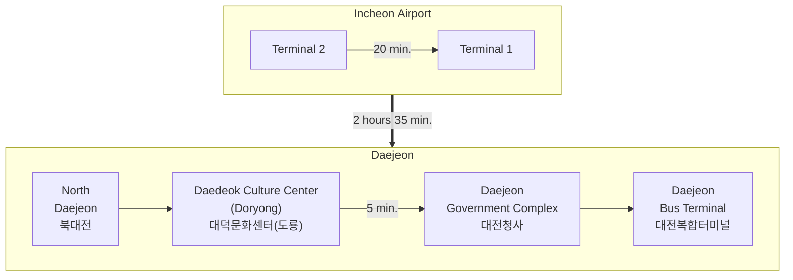

From the Incheon Airport, you can take the airport bus to the Daedeok Culture Center (or, also known as Doryong).  The bus will take you directly. The bus ride will take roughly **3 hours**.

Arrivals are on the first floor and most of the transportation options are in the Transit Center Basement 1. Buy your bus ticket at the kiosks or manned ticket office for **Daedeok Culture Center (대덕문화센터)** Bus Stop (or Doryong Bus Stop).
Pass the rail options (AREX) and your bus is located to the left at **platform 5**. There is seating near the platforms and you can recharge your phone or other electronics at one of the outlets. Your bus departure time and seat number will be on the ticket. The first bus leaves at 6:00 AM and the last bus leaves at 23:00.

#### Bus Schedule (as of May 2024)

|	Departure	|	Class	|		Fare for an Adult	(KRW)|
|  :--:		|	:--:	|	:--:	|
|	출발	|	등급	|	요금(어른)	|
|	06:00		|	Deluxe (우등)	|	25,500	|
|	06:20		|	Premium (프리미엄)	|	33,100	|
|	06:30		|	Deluxe (우등)	|	25,500	|
|	06:40		|	Deluxe (우등)	|	25,500	|
|	07:00		|	Deluxe (우등)	|	25,500	|
|	07:20		|	Deluxe (우등)	|	25,500	|
|	07:40		|	Deluxe (우등)	|	25,500	|
|	08:00		|	Premium (프리미엄)	|	33,100	|
|	08:20		|	Deluxe (우등)	|	25,500	|
|	08:40		|	Deluxe (우등)	|	25,500	|
|	09:00		|	Premium (프리미엄)	|	33,100	|
|	09:20		|	Deluxe (우등)	|	25,500	|
|	09:30		|	Deluxe (우등)	|	25,500	|
|	09:40		|	Deluxe (우등)	|	25,500	|
|	09:50		|	Premium (프리미엄)	|	33,100	|
|	10:10		|	Deluxe (우등)	|	25,500	|
|	10:20		|	Deluxe (우등)	|	25,500	|
|	10:30		|	Premium (프리미엄)	|	33,100	|
|	10:50		|	Deluxe (우등)	|	25,500	|
|	11:00		|	Deluxe (우등)	|	25,500	|
|	11:10		|	Deluxe (우등)	|	25,500	|
|	11:30		|	Premium (프리미엄)	|	33,100	|
|	11:50		|	Deluxe (우등)	|	25,500	|
|	12:10		|	Premium (프리미엄)	|	33,100	|
|	12:30		|	Deluxe (우등)	|	25,500	|
|	12:50		|	Deluxe (우등)	|	25,500	|
|	13:20		|	Premium (프리미엄)	|	33,100	|
|	13:30		|	Deluxe (우등)	|	25,500	|
|	13:40		|	Deluxe (우등)	|	25,500	|
|	14:00		|	Deluxe (우등)	|	25,500	|
|	14:20		|	Premium (프리미엄)	|	33,100	|
|	14:40		|	Deluxe (우등)	|	25,500	|
|	15:00		|	Deluxe (우등)	|	25,500	|
|	15:20		|	Premium (프리미엄)	|	33,100	|
|	15:40		|	Deluxe (우등)	|	25,500	|
|	16:00		|	Premium (프리미엄)	|	33,100	|
|	16:20		|	Deluxe (우등)	|	25,500	|
|	16:40		|	Premium (프리미엄)	|	33,100	|
|	16:50		|	Deluxe (우등)	|	25,500	|
|	17:00		|	Deluxe (우등)	|	25,500	|
|	17:20		|	Deluxe (우등)	|	25,500	|
|	17:40		|	Premium (프리미엄)	|	33,100	|
|	18:00		|	Deluxe (우등)	|	25,500	|
|	18:20		|	Premium (프리미엄)	|	33,100	|
|	18:30		|	Deluxe (우등)	|	25,500	|
|	18:40		|	Deluxe (우등)	|	25,500	|
|	19:00		|	Deluxe (우등)	|	25,500	|
|	19:20		|	Deluxe (우등)	|	25,500	|
|	19:40		|	Premium (프리미엄)	|	33,100	|
|	20:00		|	Deluxe (우등)	|	25,500	|
|	20:20		|	Premium (프리미엄)	|	33,100	|
|	20:30		|	Deluxe (우등)	|	25,500	|
|	20:50		|	Deluxe (우등)	|	25,500	|
|	21:10		|	Deluxe (우등)	|	25,500	|
|	21:30		|	Premium (프리미엄)	|	33,100	|
|	22:00		|	Deluxe (우등)	|	28,100	|
|	22:30		|	Deluxe (우등)	|	28,100	|
|	23:00		|	Deluxe (우등)	|	28,100	|

{: .note}
The prices are almost same for all four stops in Daejeon (North Daejeon, Daedeok Culture Center
     (Doryong), Government Complex, and Daejeon Bus Terminal). 

|||
|:--:|:--:|
|*Bus Ticket Kiosks*|*Bujs Ticket Office*|
|||
|*Doors to bus platforms*|*Bus platform 5*|

- Price: KRW 25,500 for deluxe and KRW 33,100 for premium. Night buses (after 10pm) are 10% more expensive.
- Schedule: Earlist at 06:00. Last at 23:00.
- [Online booking](https://intercitybuse.tmoney.co.kr/) at [https://intercitybuse.tmoney.co.kr/](https://intercitybuse.tmoney.co.kr/) :  You can check the time schedule and the current availability of the seats. 
  - Departure: IncheonAirportT2
  - Destination: Daedeokcommunitycenter
To use foreign credit cards, you may want to choose "GLOBAL CARD" in the list of credit cards. 

