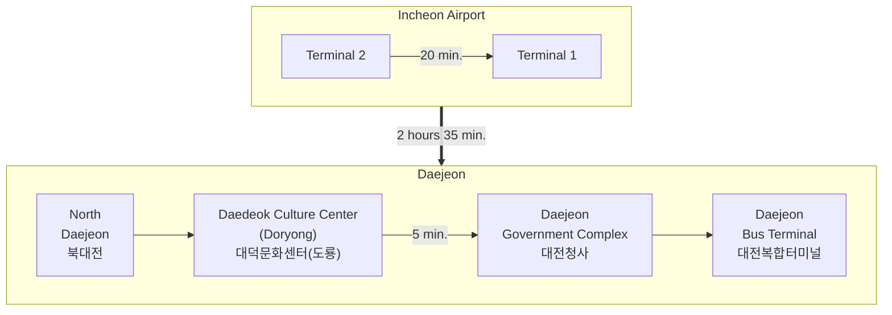


From the Incheon Airport, you can take the airport bus to the Daedeok Culture Center (or, also known as Doryong).  The bus will take you directly. The bus ride will take roughly **3 hours**.

Arrivals are on the first floor and most of the transportation options are in the Transit Center Basement 1. Buy your bus ticket at the kiosks or manned ticket office for **Daedeok Culture Center (대덕문화센터)** Bus Stop (or Doryong Bus Stop).
Pass the rail options (AREX) and your bus is located to the left at **platform 5**. There is seating near the platforms and you can recharge your phone or other electronics at one of the outlets. Your bus departure time and seat number will be on the ticket. The first bus leaves at {{ s.first_bus }} and the last bus leaves at {{ s.last_bus }}.
#### Bus Schedule (as of {{ s.updated }})

| Departure | Class | Fare for an Adult (KRW) |
| :--: | :--: | :--: |
| {{ row.time }} | {{ row.class }} | {{ row.fare }} |


{: .note}
The prices are almost same for all four stops in Daejeon (North Daejeon, Daedeok Culture Center
     (Doryong), Government Complex, and Daejeon Bus Terminal). 

```mermaid
flowchart TD;
subgraph ICN["Incheon Airport"]
direction LR
    icn2["Terminal 2"]  
    --20 min. -->icn1["Terminal 1"]
end
subgraph Daejeon
direction LR
    nd["North 
    Daejeon
    북대전"]
    --> doryong["Daedeok Culture Center
     (Doryong)
    대덕문화센터(도룡)"]
    --5 min.--> gov["Daejeon 
    Government Complex
    대전청사"]
    --> dt["Daejeon 
    Bus Terminal
    대전복합터미널"]
end

ICN == 2 hours 35 min.==>Daejeon
```

|||
|:--:|:--:|
|*Bus Ticket Kiosks*|*Bujs Ticket Office*|
|||
|*Doors to bus platforms*|*Bus platform 5*|

- Price: KRW 25,500 for deluxe and KRW 33,100 for premium. Night buses (after 10pm) are 10% more expensive.
- Schedule: Earliest at {{ s.first_bus }}. Last at {{ s.last_bus }}.
- [Online booking](https://intercitybuse.tmoney.co.kr/) at [https://intercitybuse.tmoney.co.kr/](https://intercitybuse.tmoney.co.kr/) :  You can check the time schedule and the current availability of the seats. 
  - Departure: IncheonAirportT2
  - Destination: Daedeokcommunitycenter

It was announced that foreign credit cards (VISA, Master, JCB, UnionPay) would work on this website from July 2024. Please let us know if it worked. If you want to use foreign credit cards, you may want to choose "GLOBAL CARD" in the list of credit cards. For "Card Password", it only neeeds the first 2 digits of your credit card password. For "Resident Registration Number (front 6 digits"), you simply need to type your birthday in YYMMDD format. For the Cellular Phone number, if you don't have the Korean mobile phone number, put any number. That is for the identification. For the Card Password, you only need to put the first 2 digits of your credit card PIN code.

