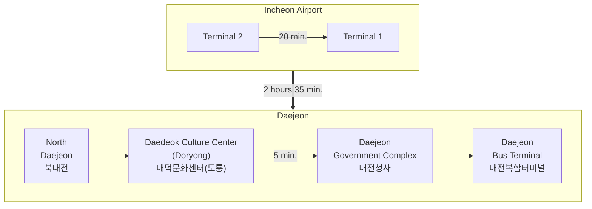

For most visitors, this is the most recommended method to visit IBS.
From the Incheon Airport, you can take the airport bus to the Daejeon Government Complex. The bus will take you directly. The bus ride will take roughly **3 hours**.

Arrivals are on the first floor and most of the transportation options are in the Transit Center Basement 1. Buy your bus ticket at the kiosks or manned ticket office for **Daejeon Government Complex (대전청사)** Bus Stop. 
Pass the rail options (AREX) and your bus is located to the left at **platform 5**. There is seating near the platforms and you can recharge your phone or other electronics at one of the outlets. Your bus departure time and seat number will be on the ticket. The first bus leaves at 6:00 AM and the last bus leaves at 23:00.

{: .note}
The prices are the same for all four stops in Daejeon (North Daejeon, Daedeok Culture Center
     (Doryong), Government Complex, and Daejeon Bus Terminal). Although the Doryong is also close to IBS, there are not many taxis waiting at the stop -- walking to IBS will take more than 30 minutes. This is a reason why we recommend the Government Complex stop.

|||
|:--:|:--:|
|*Bus Ticket Kiosks*|*Bujs Ticket Office*|
|||
|*Doors to bus platforms*|*Bus platform 5*|

- Price: KRW 26,100 for deluxe and KRW 34,000 for premium. Night buses (after 10pm) are 10% more expensive.
- Schedule: Earlist at 06:00. Last at 23:00.
- [Online booking](https://intercitybuse.tmoney.co.kr/) at [https://intercitybuse.tmoney.co.kr/](https://intercitybuse.tmoney.co.kr/) :  You can check the time schedule and the current availability of the seats. But it is not yet clear whether it accepts a credit card issued by foreign banks -- please let us know if it works.
  - Departure: IncheonAirportT2
  - Destination: DaejeonGovComplex

Other than a very small sign, there is no written signage and this bus stop doesn't appear on many maps. Don't let that stop you as many people get off buses here; so many that there is always a queue of taxis waiting to pick up passengers.