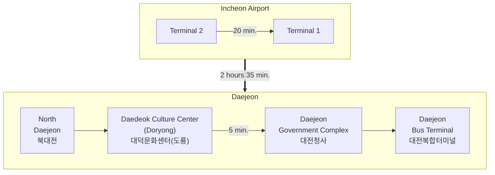

For most visitors, this is the most recommended method to visit IBS.
From the Incheon Airport, you can take the airport bus to the Daejeon Government Complex. The bus will take you directly. The bus ride will take roughly **3 hours**.

Arrivals are on the first floor and most of the transportation options are in the Transit Center Basement 1. Buy your bus ticket at the kiosks or manned ticket office for **Daejeon Government Complex (대전청사)** Bus Stop. 
Pass the rail options (AREX) and your bus is located to the left at **platform 5**. There is seating near the platforms and you can recharge your phone or other electronics at one of the outlets. Your bus departure time and seat number will be on the ticket. The first bus leaves at 6:00 AM and the last bus leaves at 23:00.

#### Bus Schedule (as of June 2025)

|	Departure	|	Arrival	|	Class	|		Fare for an Adult	(KRW)|
|  :--:	|	:--:	|	:--:	|	:--:	|
|	출발	|	도착	|	등급	|	요금(어른)	|
|	06:00	|	09:01	|	Deluxe (우등)	|	26,100	|
|	06:20	|	09:21	|	Premium (프리미엄)	|	34,000	|
|	06:30	|	09:31	|	Deluxe (우등)	|	26,100	|
|	06:40	|	09:41	|	Deluxe (우등)	|	26,100	|
|	07:00	|	10:01	|	Deluxe (우등)	|	26,100	|
|	07:20	|	10:21	|	Deluxe (우등)	|	26,100	|
|	07:40	|	10:41	|	Deluxe (우등)	|	26,100	|
|	08:00	|	11:01	|	Premium (프리미엄)	|	34,000	|
|	08:10	|	11:11	|	Deluxe (우등)	|	26,100	|
|	08:40	|	11:41	|	Deluxe (우등)	|	26,100	|
|	08:50	|	11:51	|	Deluxe (우등)	|	26,100	|
|	09:00	|	12:01	|	Premium (프리미엄)	|	34,000	|
|	09:20	|	12:21	|	Deluxe (우등)	|	26,100	|
|	09:30	|	12:31	|	Deluxe (우등)	|	26,100	|
|	09:40	|	12:41	|	Deluxe (우등)	|	26,100	|
|	09:50	|	12:51	|	Premium (프리미엄)	|	34,000	|
|	10:10	|	13:11	|	Deluxe (우등)	|	26,100	|
|	10:20	|	13:21	|	Deluxe (우등)	|	26,100	|
|	10:30	|	13:31	|	Premium (프리미엄)	|	34,000	|
|	10:50	|	13:51	|	Deluxe (우등)	|	26,100	|
|	11:00	|	14:01	|	Deluxe (우등)	|	26,100	|
|	11:10	|	14:11	|	Deluxe (우등)	|	26,100	|
|	11:20	|	14:21	|	Deluxe (우등)	|	26,100	|
|	11:30	|	14:31	|	Premium (프리미엄)	|	34,000	|
|	11:50	|	14:51	|	Deluxe (우등)	|	26,100	|
|	12:10	|	15:11	|	Premium (프리미엄)	|	34,000	|
|	12:30	|	15:31	|	Deluxe (우등)	|	26,100	|
|	12:50	|	15:51	|	Deluxe (우등)	|	26,100	|
|	13:20	|	16:21	|	Premium (프리미엄)	|	34,000	|
|	13:30	|	16:31	|	Deluxe (우등)	|	26,100	|
|	13:40	|	16:41	|	Deluxe (우등)	|	26,100	|
|	14:00	|	17:01	|	Deluxe (우등)	|	26,100	|
|	14:20	|	17:21	|	Premium (프리미엄)	|	34,000	|
|	14:30	|	17:31	|	Deluxe (우등)	|	26,100	|
|	14:40	|	17:41	|	Deluxe (우등)	|	26,100	|
|	15:00	|	18:01	|	Deluxe (우등)	|	26,100	|
|	15:20	|	18:21	|	Premium (프리미엄)	|	34,000	|
|	15:40	|	18:41	|	Deluxe (우등)	|	26,100	|
|	16:00	|	19:01	|	Premium (프리미엄)	|	34,000	|
|	16:20	|	19:21	|	Deluxe (우등)	|	26,100	|
|	16:40	|	19:41	|	Premium (프리미엄)	|	34,000	|
|	16:50	|	19:51	|	Deluxe (우등)	|	26,100	|
|	17:00	|	20:01	|	Deluxe (우등)	|	26,100	|
|	17:20	|	20:21	|	Deluxe (우등)	|	26,100	|
|	17:40	|	20:41	|	Premium (프리미엄)	|	34,000	|
|	18:00	|	21:01	|	Deluxe (우등)	|	26,100	|
|	18:20	|	21:21	|	Premium (프리미엄)	|	34,000	|
|	18:30	|	21:31	|	Deluxe (우등)	|	26,100	|
|	18:40	|	21:41	|	Deluxe (우등)	|	26,100	|
|	19:00	|	22:01	|	Deluxe (우등)	|	26,100	|
|	19:20	|	22:21	|	Deluxe (우등)	|	26,100	|
|	19:30	|	22:31	|	Deluxe (우등)	|	26,100	|
|	19:50	|	22:51	|	Premium (프리미엄)	|	34,000	|
|	20:00	|	23:01	|	Deluxe (우등)	|	26,100	|
|	20:20	|	23:21	|	Premium (프리미엄)	|	34,000	|
|	20:30	|	23:31	|	Deluxe (우등)	|	26,100	|
|	20:50	|	23:51	|	Deluxe (우등)	|	26,100	|
|	21:10	|	24:11	|	Deluxe (우등)	|	26,100	|
|	21:30	|	24:31	|	Premium (프리미엄)	|	34,000	|
|	22:00	|	01:01	|	Deluxe (우등)	|	28,700	|
|	22:30	|	01:31	|	Deluxe (우등)	|	28,700	|
|	23:00	|	02:01	|	Deluxe (우등)	|	28,700	|

{: .note}
The prices are almost same for all four stops in Daejeon (North Daejeon, Daedeok Culture Center
     (Doryong), Government Complex, and Daejeon Bus Terminal). Although the Daedeok Culture Center is also close to IBS, there are not many taxis waiting at the stop. 
     If you don't mind walking with luggages, 
     then it is possible to get off at the Daedeok Culture Center (Doryong) stop and walk for 30 minutes to IBS.
     Otherwise it is difficult to get a taxi at this location and we recommend the Government Complex stop.

```mermaid
flowchart TD;
subgraph ICN["Incheon Airport"]
direction LR
    icn2["Terminal 2"]  
    --20 min. -->icn1["Terminal 1"]
end
subgraph Daejeon
direction LR
    nd["North 
    Daejeon
    북대전"]
    --> doryong["Daedeok Culture Center
     (Doryong)
    대덕문화센터(도룡)"]
    --5 min.--> gov["Daejeon 
    Government Complex
    대전청사"]
    --> dt["Daejeon 
    Bus Terminal
    대전복합터미널"]
end

ICN == 2 hours 35 min.==>Daejeon
```

|||
|:--:|:--:|
|*Bus Ticket Kiosks*|*Bujs Ticket Office*|
|||
|*Doors to bus platforms*|*Bus platform 5*|

- Price: KRW 26,100 for deluxe and KRW 34,000 for premium. Night buses (after 10pm) are 10% more expensive.
- Schedule: Earlist at 06:00. Last at 23:00.
- [Online booking](https://intercitybuse.tmoney.co.kr/) at [https://intercitybuse.tmoney.co.kr/](https://intercitybuse.tmoney.co.kr/) :  You can check the time schedule and the current availability of the seats. 
  - Departure: IncheonAirportT2
  - Destination: DaejeonGovComplex

It was announced that foreign credit cards (VISA, Master, JCB, UnionPay) would work on this website from July 2024. Please let us know if it worked. If you want to use foreign credit cards, you may want to choose "GLOBAL CARD" in the list of credit cards. For "Card Password", it only needs the first 2 digits of your credit card password. For "Resident Registration Number (front 6 digits"), you simply need to type your birthday in YYMMDD format. For the Cellular Phone number, if you don't have the Korean mobile phone number, put any number. That is for the identification. For the Card Password, you only need to put the first 2 digits of your credit card PIN code.

Other than a very small sign, there is no written signage and this bus stop doesn't appear on many maps. Don't let that stop you as many people get off buses here; so many that there is always a queue of taxis waiting to pick up passengers. Some visitors reported that a stranger approached them to offer a ride for a cash; do not follow them. 